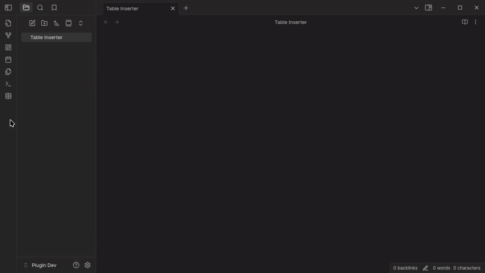
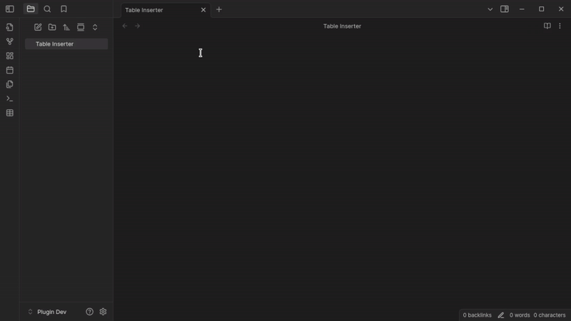
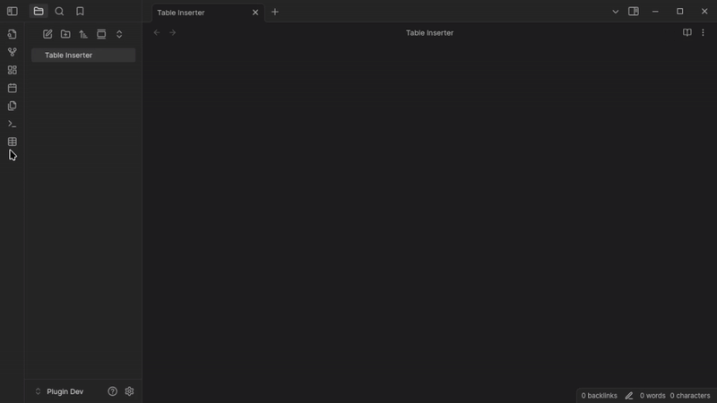

# Obsidian Table Inserter
A plugin that adds a MS Word style table insertion dialog.

## Features
1. Button on the ribbon to open a dialog to insert a table.
1. Option to replace the right click Insert > Table option with the table inserter dialog.
1. Option to replace the command palette Insert > Table option with the table inserter dialog.
1. Keyboard shortcut to open the table inserter dialog.
1. Choose the cell alignment for the table.

## Settings
==screenshot of settings==

## Examples

### Right Click Menu

### Custom Size

### Issues
If you encounter any bugs or have feature requests, please open an issue on the github repository [here](https://github.com/MikhaD/obsidian-table-inserter/issues).

Created by [MikhaD](https://mikha.dev). Please leave a star on the [repository](https://github.com/MikhaD/obsidian-table-inserter) if you like the plugin ⭐